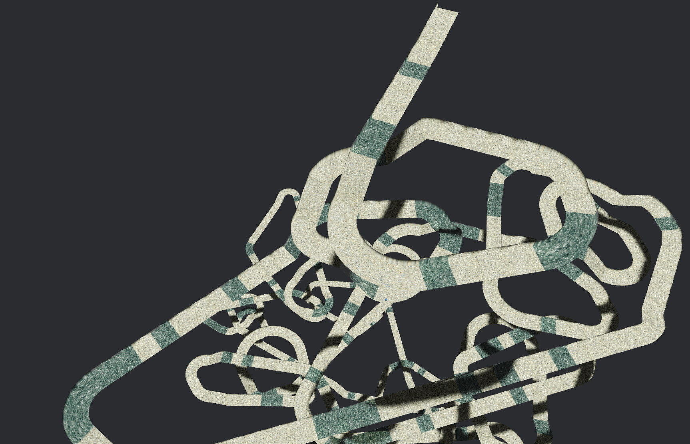
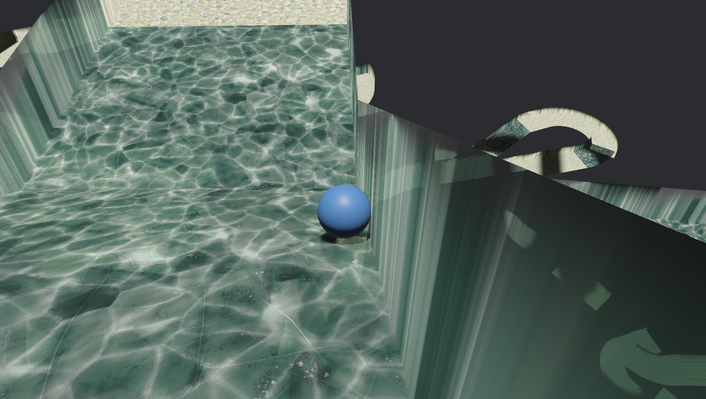

# Bot Marble Racing

Welcome to the **Bot Marble Racing** project, developed to facilitate a hackathon!


<table>
  <tr>
    <td>Server Overview</td>
     <td>Client View</td>
  </tr>
  <tr>
    <td></td>
    <td></td>
  </tr>
 </table>

---

## Architecture Overview


```mermaid
flowchart LR
    GS[Game Server] <-->|Netcode| GC

    subgraph GC[Game Client]
        GAME_LOGIC[Game Logic]
        GRPC_SERVER[gRPC Server]
        GAME_LOGIC --- GRPC_SERVER
    end

    BOT[Bot] -->|gRPC Connection| GRPC_SERVER

    %% Styling
    classDef server fill:#f96,stroke:#333,stroke-width:2px;
    classDef client fill:#69f,stroke:#333,stroke-width:2px;
    class GS,GRPC_SERVER server;
    class GAME_LOGIC,BOT client;
 ```

### 1. **Game Server**
The server hosts the racing game environment and provides the following functionalities:
- Rendering the racing track and marbles with a free camera (WASD + mouse + E/C for Up/Down).
- Generating real-time game states, including the track layout, marble positions, and environmental conditions (e.g., ice zones).
- Broadcasting game updates to connected clients.

### 2. **Game Client**
The client represents the bot's interface with the game and includes:
- A **gRPC server** that exposes endpoints to interact with the bot's logic.
- Control mechanisms to adjust the marble's torque and direction.
- Game rendering and allow a to play the game yourself to familiarize yourself with the mechanics before building the Bot

### 3. **gRPC Server**
The gRPC server serves as the communication bridge between the client and the bot. It handles:
- Provide game state information from the client to the bot.
- Receive inputs mirroring the controlls available in the client

### 4. **Bot**
This is the component you will build during the hackathon. The releases contain some scaffolding for running/evaluating the bot.
- Interacts with the game client over grpc
- There is a sample framework in the [./bot](bot directory), it is provided also in the release.

---

## Getting Started

### Prerequisites
Download the [release](https://github.com/julianbieber/hackathon_2/releases) and extract the zip file.
The zip contains the server and client binaries for linux and windows + the assets used for the ui and an example bot.
You need [uv](https://docs.astral.sh/uv/getting-started/installation/) to run the example bot.

On Linux you might need to install the following packages (ubuntu).

```bash
sudo apt-get install --no-install-recommends 'libasound2-dev' 'libudev-dev' 'libwayland-dev' 'libxkbcommon-dev' 'protobuf-compiler'
```

### How to use the example bot?
You can run the example bot with the following command.
It will start the game server, 1 game client and create a gRPC connection to the game client.
The bot will then run a loop of GetGameState, make a decision on which buttons to press, and send those button presses to the client.
Furthermore, the bot records its state/decision combinations in a dataframe and create viewable pngs for the screenshots.
The function `MarbleClient.decision` is currently responsible for deciding which input to provide to the server.


(Please note at the moment it is still work in progress) 
```bash
uv run python main.py
```

### How to play the game manually?
You will need to first start the server and then the client. Both executables (server/client on linux and server.exe/client.exe) have some command line parameters but for a simple one player game of up to 2 minutes you can simple double click the executables to start them.


### Cli args
```
Usage: server [OPTIONS]

Options:
      --auth-port <AUTH_PORT>
          port number used for authenticating clients to the server. If you run multiple servers concurrently each one needs a unqiue port number [default: 4000]
      --game-port <GAME_PORT>
          port number used for the game. If you run multiple servers concurrently each one needs a unique port number [default: 5000]
      --players <PLAYERS>
          Number of players expected to join. The game will start to run once the expected number of players have joined [default: 1]
      --max-game-seconds <MAX_GAME_SECONDS>
          Number of seconds the game will last at max. Once either every player has reached the finish line or this time has been reached, the rankings within the match will be calculated [default: 120]
  -h, --help
          Print help
```

```
Usage: client [OPTIONS]

Options:
      --server <SERVER>            Ip address of the game server [default: 127.0.0.1]
      --auth-port <AUTH_PORT>      Authentication port of the game server [default: 5000]
      --client-port <CLIENT_PORT>  Port used by the client for the bidirectional communication. Needs to be unqiue [default: 5001]
      --grpc-port <GRPC_PORT>      Port used to start a grpc server and remote control this client
      --name <NAME>                Player name chosen for the game [default: Player1]
  -h, --help                       Print help
```


